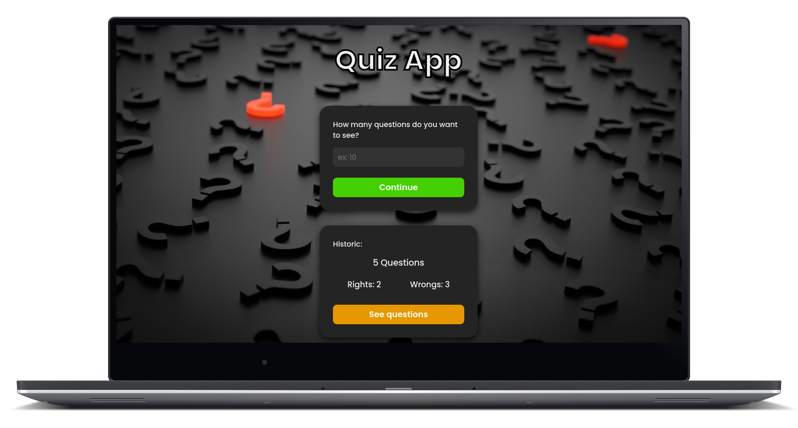
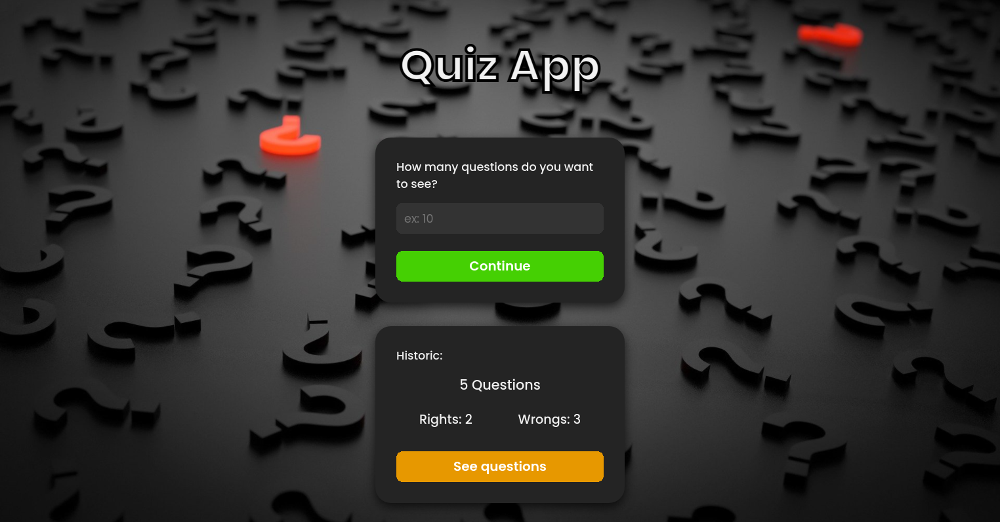
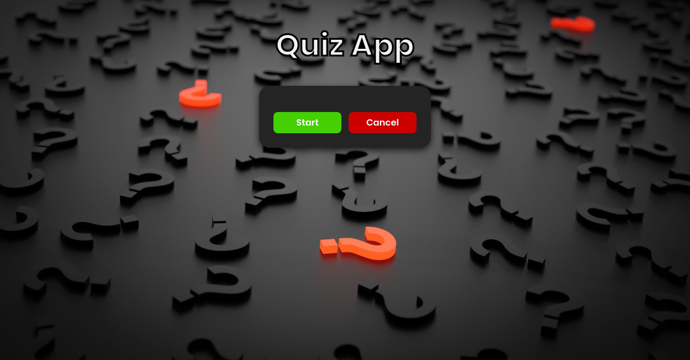
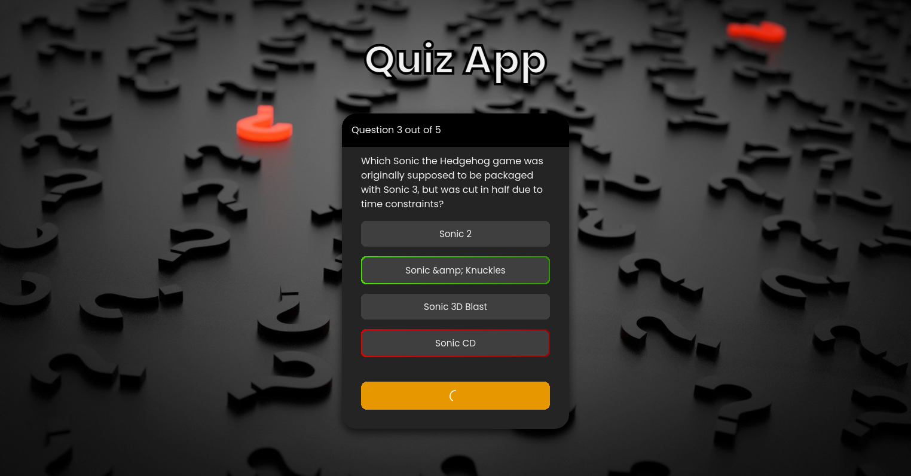
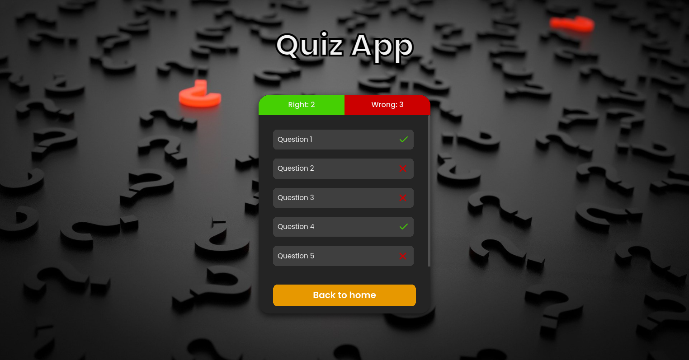
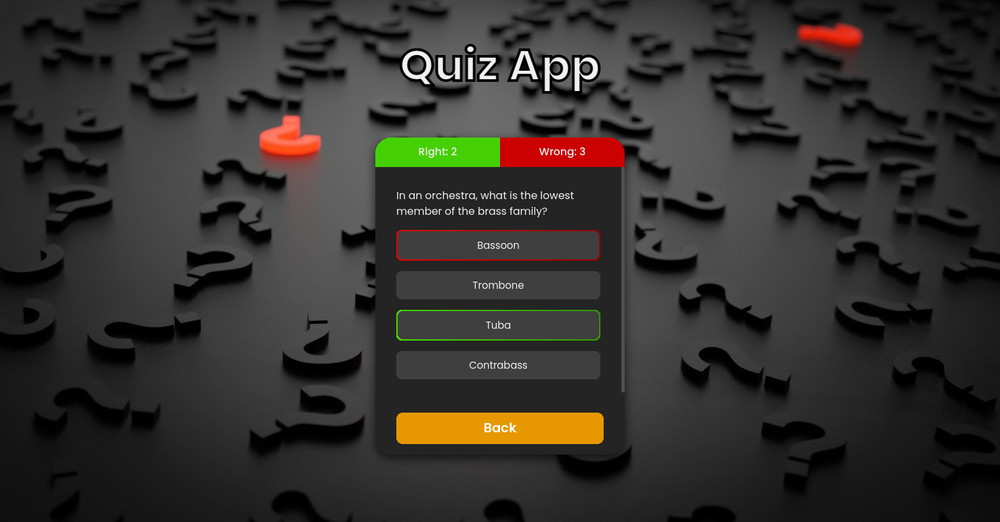

<div 
  align="center"
  style="
    background: #222222;
    border-radius: 1.5rem;
    display: flex;
    alight-itens:center;
    justify-content: center;
    flex-direction: column;
    padding: 10px 60px;
    margin: 10px 20px;
    border: 2px solid #bbb;
  ">
  
  <h1 align="center">
      
  </h1>

[](LICENSE.md)


</div>

<div align="center">

<br>

<p align="center">
  <strong>
      <a href="#-projeto">Projeto</a> &nbsp;|&nbsp; 
  </strong>
  <strong>
      <a href="#-layout">Layout</a> &nbsp;|&nbsp; 
  </strong>
  <strong>
      <a href="#-tecnologias">Tecnologias</a> &nbsp;|&nbsp; 
  </strong>
  <strong>
      <a href="#-como-executar-o-projeto">Executando</a> &nbsp;|&nbsp; 
  </strong>
  <strong>
      <a href="#-autor">Autor</a> 
  </strong>
</p>

<p align="center">
  
</p>
</div>

## **✨ Preview**

#### Sistema Online: https://quizapp-top.vercel.app

---

## **💻 Projeto**

Quiz app é um Website de perguntas gerais onde você escolhe o numero de perguntas e tenta acertar o maximo delas.

---

## **🔖 Layout**

Você pode visualizar o layout do projeto no formato através [desse link](https://www.figma.com/file/uzzMOfpPqnjbpEp74UFZue/Quiz-App?node-id=0%3A1). Lembrando que você irá precisar ter uma conta no [Figma](http://figma.com/).

#### **Web**

  <div>
    
    <br/>
    <br/>
    
    <br/>
    <br/>
    
    <br/>
    <br/>
    
    <br/>
    <br/>
    
  <div>

---

## **💻 Tecnologias**

#### **Website** ([React][react])

- **[Typescript][typescript]**
- **[React][react]**
- **[Material UI][material_ui]**
- **[Formik][formik]**
- **[Axios][axios]**
- **[Yup][yup]**
- **[React Icons][react_icons]**

> \* Veja o arquivo <kbd>[package.json](./package.json)</kbd>

#### **Utilitários**

- Editor: **[Visual Studio Code][vscode]**
- Markdown: **[StackEdit][stackedit]**, **<kbd>[Markdown Emoji][markdown_emoji]</kbd>**

---

## **🚀 Como executar o projeto**

### Configurações Iniciais

Primeiro, você precisa ter o <kbd>[NodeJS](https://nodejs.org/en/download/)</kbd> instalado na sua máquina.

Após ter o **Node** instalado, Instale as dependências contidas nos arquivos `package.json` que se encontram na raíz do repositório. Para instalar as dependências, basta abrir o terminal no diretório e digitar o comando:

```sh
# Instalando as dependencias:
$ npm install

#  ou

$ yarn
```

> Veja a parte de **scripts {}** do arquivo <kbd>[package.json](./package.json)</kbd> para saber quais scripts estão disponíveis.

### Executando o WebSite

```sh
$ npm run dev

#    ou

$ yarn dev
```

<br/>

> Se o browser não abrir automaticamente, acesse: http://localhost:3000.

<br/>

---

## **👨‍🚀 Autor**

<a href="https://github.com/jairodoni">
 
  <br />
  <sub>
    <b>Jairo Doni Prudente Junior</b>
  </sub>
</a>
<br />

👋 Entre em contato!

[](https://www.linkedin.com/in/jairodoni/)
[](mailto:jairo.doni97@gmail.com)

## **📝 Licença**

Esse projeto está sob a licença MIT. Veja o arquivo [LICENSE](LICENSE.md) para mais detalhes.

<!-- Badges -->

[repository_license_badge]: https://img.shields.io/github/license/JairoDoni/NLW-1.0
[web_react_badge]: https://img.shields.io/badge/web-react-blue
[typescript_shields]: https://img.shields.io/badge/types-Typescript-blue

<!-- Techs -->

[react]: https://reactjs.org/
[react_doc]: https://reactjs.org/docs/getting-started.html
[react_doc_ptbr]: https://pt-br.reactjs.org/docs/getting-started.html
[node]: https://nodejs.org/en/
[vscode]: https://code.visualstudio.com/
[typescript]: https://www.typescriptlang.org/
[material_ui]: https://mui.com/pt/
[formik]: https://formik.org
[react_icons]: https://react-icons.github.io/react-icons/
[yup]: https://github.com/jquense/yup
[axios]: https://github.com/axios/axios
[asdf]: https://github.com/asdf-vm/asdf
[yarn]: https://classic.yarnpkg.com/en/docs/install/#debian-stable
[stackedit]: https://stackedit.io
[markdown_emoji]: https://gist.github.com/rxaviers/7360908
